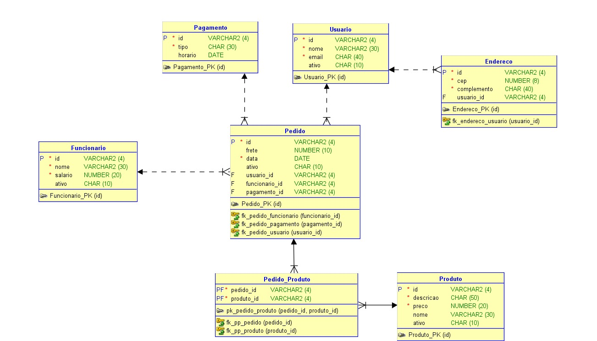

# 🛒🛍️ Novvi 🛍️🛒

## 🗣️ Quem Somos 
- Carolina Nascimento Gonçalves – RM: 564786 – 2TDSPJ
- Emanuelly Ventura do Nascimento – RM: 562339 – 2TDSPJ
- Julia Sayuri Kina – RM: 564555 – 2TDSPJ

## 🌐 Domínio escolhido
Este projeto foi desenvolvido com base no domínio de um sistema de loja online (Novvi). A proposta do sistema é representar, de forma estruturada, os principais elementos de um fluxo de compra, permitindo o gerenciamento das informações essenciais de usuários, produtos, pedidos, pagamentos, endereços e funcionários.

## 🧩 Entidades Modeladas
Usuário:
- Representa a pessoa que utiliza o sistema e realiza solicitações de pedidos.
- Atributos: id_usu, nome_usu, email_usu e ativo_usu.

Endereço:
- Representa os endereços associados aos usuários.
- Atributos: id_end, cep_end e complemento_end.

Pedido:
- Representa a solicitação de compra realizada no sistema.
- Atributos: id_ped, frete_ped, data_ped e ativo_ped.

Produto:
- Representa os itens que podem ser selecionados em um pedido.
- Atributos: id_pro, nome_pro, descricao_pro, preco_pro e ativo_pro.

Pagamento:
- Representa as informações relacionadas ao pagamento de um pedido.
- Atributos: id_pag, tipo_pag e horario_pag.

Funcionário:
- Representa o colaborador responsável por realizar ou acompanhar pedidos no sistema.
- Atributos: id_fun, nome_fun, salario_fun e ativo_fun.
 
## 🔄 Relacionamentos
Usuário — possui — Endereço (1:N):
- Um usuário pode possuir vários endereços, enquanto um endereço pertence a um único usuário. Esse relacionamento permite que o sistema armazene diferentes endereços para um mesmo usuário, como endereço residencial, comercial ou de entrega.

Usuário — solicita — Pedido (1:N):
- Um usuário pode solicitar vários pedidos, enquanto cada pedido está associado a apenas um usuário.

Pedido — seleciona — Produto (N:N):
- Um pedido pode conter vários produtos, e um produto pode aparecer vários pedidos.

Pedido — possui — Pagamento (1:1):
- Um pedido pode possuir apenas um pagamento, e um pagamento está associado a apenas um pedido. Esse relacionamento demonstra que o pagamento é único e vinculado a um pedido específico.

Funcionário — realiza — Pedido (1:N):
- Um funcionário pode realizar vários pedidos, enquanto cada pedido pode ser realizado por apenas um funcionário.

## 📊 Diagrama
Confira abaixo nosso diagrama de arquitetura do projeto:

## 🔗 Acesse nosso Repositório
Veja mais a fundo toda a estrutura do nosso projeto com o Github!  
[Clique aqui para acessar](https://github.com/carolnascgoncalves/Novvi.git)

## 🧾 Licença
Este projeto é de uso acadêmico e sem fins lucrativos.  
[Markdown](https://docs.github.com/github/writing-on-github/getting-started-with-writing-and-formatting-on-github/basic-writing-and-formatting-syntax)
